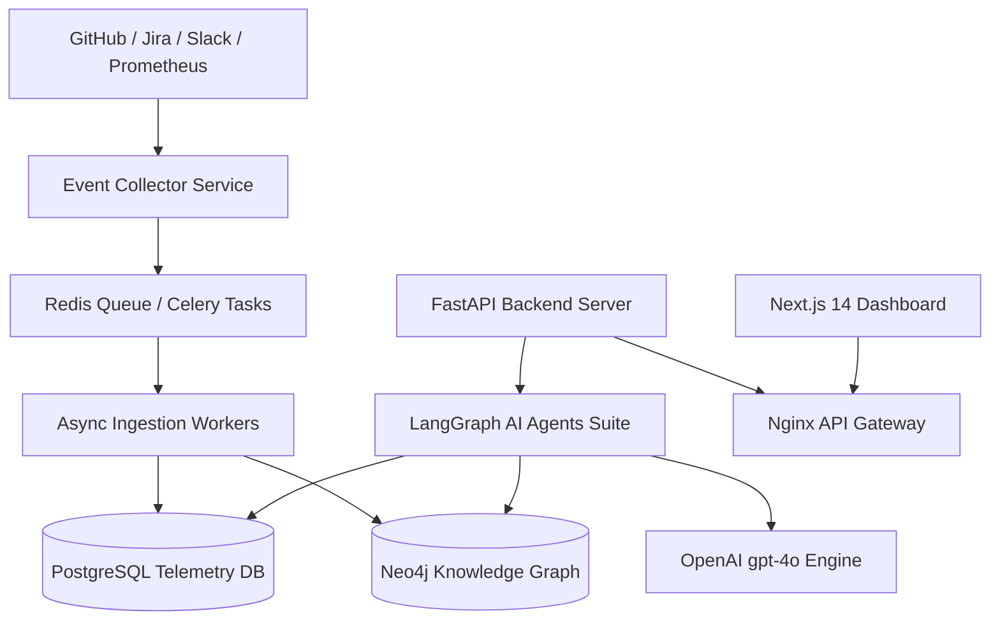

# Architecture Documentation: EngineeringOS AI

## 1. High-Level Architecture Overview

EngineeringOS AI follows **Clean Architecture** and **Domain-Driven Design (DDD)** principles to decouple system telemetry ingestion, knowledge graph state management, and autonomous AI agents.



---

## 2. Neo4j Knowledge Graph Schema

```
(:Developer)-[:CREATED]->(:PullRequest)
(:PullRequest)-[:TOUCHES]->(:Microservice)
(:Microservice)-[:USES]->(:Database)
(:Deployment)-[:CAUSED]->(:Incident)
(:Developer)-[:MEMBER_OF]->(:Team)
```

---

## 3. LangGraph AI Agent State Machine Architecture

Every AI agent (PR Risk, Sprint Prediction, Incident Prediction, Developer Insight, Grounded Chat) is implemented as a compiled **LangGraph `StateGraph`**:

1. **State Definition (`TypedDict`):** Manages input parameters, retrieved context, evidence citations, and output scores.
2. **Context Retrieval Nodes:** Executes async Cypher graph traversals on Neo4j and relational queries on PostgreSQL.
3. **Synthesis Node:** Uses OpenAI (`gpt-4o`) with deterministic zero-hallucination prompts (`temperature=0.0`).

---

## 4. Multi-Channel Notification Architecture

Notifications are managed by an asynchronous `AlertEngine` using parallel `asyncio.gather` dispatch across:
- **Slack:** Block Kit formatting.
- **Email:** SMTP HTML digest templates.
- **GitHub Comments:** PR review comments via GitHub REST API.
- **Microsoft Teams:** Adaptive Cards.

All channel providers wrap outbound HTTP requests in `tenacity` exponential backoff retry policies.
